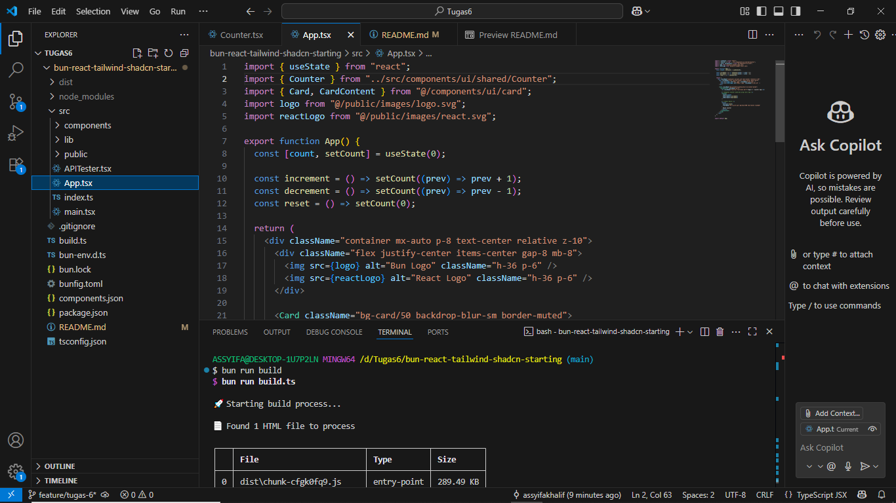
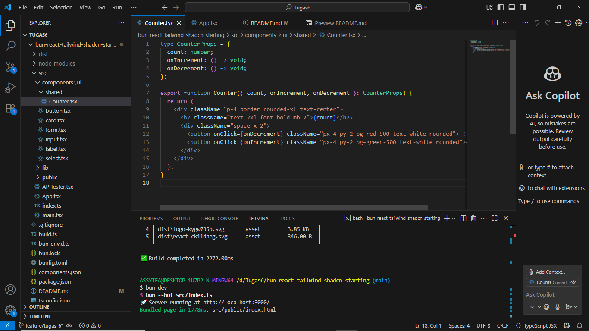

# Bun React Tailwind Project

**Nama Lengkap:** Assyifa Khalif


## 🎯 Tujuan Tugas
- Memahami inisialisasi project React + Bun + Tailwind
- Penerapan `useState`, Props, dan Lifting State Up

## 🚀 Cara Menjalankan

```bash
bun install
bun run build
bun dev
```
## Stuktur Folder
```
components/
  └── shared/
      └── Counter.tsx
```
## Screenshoot📸


